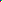
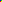
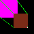
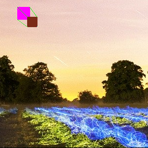

# bah-bmp
This is a really simple library for handling **uncompressed (at least for now)** bitmaps.

## Testing
You can do `bah ./test.bah` to compile the test program.
When executing, the expected output is the following:
- `test.bmp`  (a 2x2 image with blue, green, red, white pixels)
- `test2.bmp`  (a 2x2 image with blue, green, red, yellow pixels)
- `test3.bmp`  (a 50x50 image with a pink rectangle and a borwn rectangle on top of it, all corners except theirs bottom right corner should be connected with green lines).
- `test4.bmp`  (a 1920x1080 image of the sample image with the created above image in the middle).
- `test5.bmp`  (a 300x300 image that is a part of the above image).